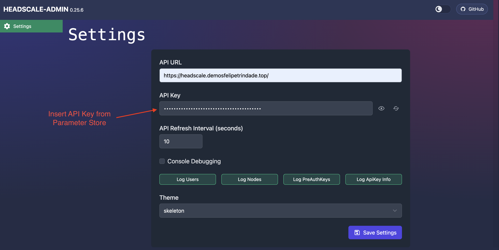
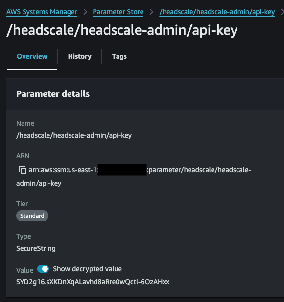
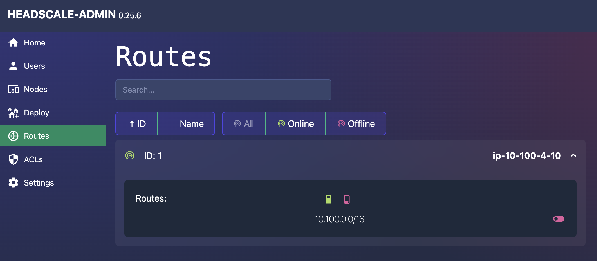
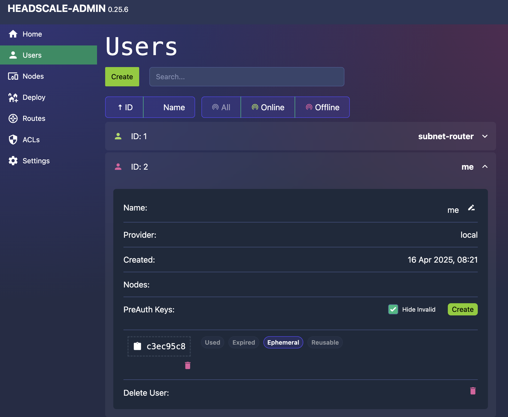
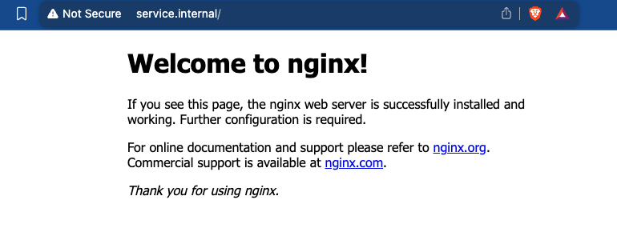
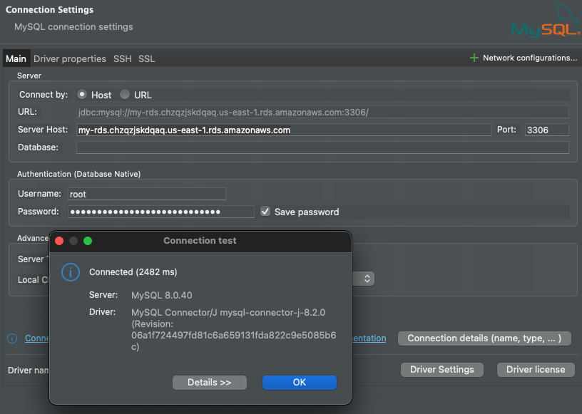

# VPN - Headscale
This is a demo repository for my [blog post](http://felipetrindade.com/headscale)

Prerequisites:
- Public Hosted Zone with Domain configured in Route 53

1) Install dependencies of the repository

```sh
devbox shell
```

2) Initialize Terraform

```sh
cd infrastructure
terraform init
```

3) Create a file to define variables
You can check the README below to see the required variables (or check variables.tf file directly).

Here is one example of a valid file (modify it for your use case)

```hcl
# vars.tfvars
aws_region = "us-east-1"
domain = "mydomain.tld"
headscale_acme_email = "me@mydomain.tld"
headscale_hostname = "headscale.mydomain.tld"
```

Make sure the domain is deployed as a public hosted zone in Route 53.

4) Apply Terraform and create the infrastructure

Remember to have valid AWS credentials in your terminal!

```sh
terraform apply --var-file=vars.tfvars
```

5) Wait until Headscale gets deployed
The user_data script will run in all EC2. You should wait the user_data of the headscale control plane gets ready. You can check if the admin (headscale community console) is available. It is available in the `/admin` route, i.e. if you defined `headscale_hostname` as `headscale.mydomain.tld`, then you will need to wait `https://headscale.mydomain.tld/admin` to be available.

6) Access Headscale Admin
Use the API Key generated by the Headscale server. You can get the API Key value in Parameter Store via AWS Console or via AWS CLI running the command `aws ssm get-parameter --with-decryption --name "/headscale/headscale-admin/api-key" --query "Parameter.Value" --output text`. Refresh the page when you save the API Key value.



You can also get the API Key from the AWS Console.



7) Authorize Subnet Router route

Go to the `Routes` session and authorize the route created by the Subnet Router.



8) Create a new user for yourself

Give it a name and issue a PreAuth Key, we will use it in the next step.



9) Connect to Tailnet (Tailscale network)

Now that you have the PreAuth Key for your user, let's connect using the CLI. Substitute the `<PRE_AUTH_KEY>` with the one you generated in the previous step and `<HEADSCALE_HOSTNAME>` with what you defined on the Terraform vars.

```sh
tailscale up --accept-dns --accept-routes \
 --login-server=https://<HEADSCALE_HOSTNAME> \
  --auth-key=<PRE_AUTH_KEY>
```

Run `tailscale status`. You will see the `subnet-router` there!

10) Reach private server

We deployed an EC2 with an NGINX installed (pretend it's a real application). The internal Route53 Hosted zone was a DNS record called `service.internal` that points to this service. Open your browser and try to reach `http://service.internal/`.

The Subnet Router is being configured as the DNS server of the Tailnet in the Headscale configuration. Because of that, we are also installing `dnsmasq` to resolve all ".internal" domains.



11) Access Database

I'm using DBeaver to connect to the MySQL database. Check AWS Secrets Manager for the secret that contains the root credential.



12) Disconnect from the Tailnet

```sh
tailscale down
```

Try to reach the private server or the database! You won't be able to reach, us as we expected!